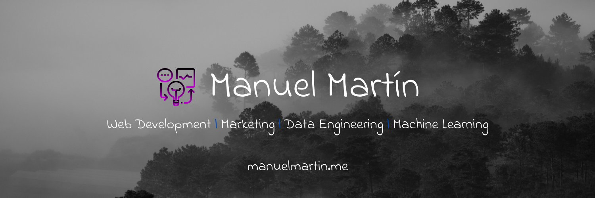

## Hello, I'm Manuel! :punch:

I’m a passionate **Data Scientist** and **AI Enthusiast** from Spain 🇪🇸 with a diverse background in **Marketing**, **Development**, **Data Engineering**, and **Entrepreneurship**. My journey in these fields began in 2015-2016, and since then, I've had the privilege of working on various projects as a consultant while building my own side projects and startups.

Currently, I’m a partner at **Keytrends**, a B2B Content Marketing SaaS, where I lead as the **Head of Data & AI**. In this role, I’m building and leading Data & AI teams, integrating cutting-edge technologies like **RNNs**, **Transformers**, and **CNNs** into our products while closely collaborating with our Product & Design teams.

### Academic Pursuits 📚

I'm currently pursuing a **Bachelor's degree in Data Science** at UPV in Valencia, where I’m finishing my second year. Alongside, I've embarked on a **Predoctoral position in AI & Genetics** at VRAIN, diving deep into the intersection of these exciting fields.

### Freelance & Open Source Contributions 🌍

In addition to my roles at Keytrends and my academic endeavors, I work as a **freelancer** helping companies enhance their **marketing**, **analytics**, **data**, and **development** strategies. I also enjoy contributing to Open Source projects like **Clickhouse** and **NodeJS**.

### Development Skills 💻

Over the years, I’ve gained experience across the development stack—**frontend**, **backend**, **DevOps**—but my true passion lies in **backend development** and **data engineering**. I love working with technologies like **Python**, **TypeScript**, **Kubernetes**, **Docker**, and **Jenkins**.

### What Excites Me 🎯

Machine Learning is my biggest passion. As the **Head of AI**, I’m constantly learning and applying new technologies in real-world scenarios, particularly in areas involving **neural networks** and **data-driven AI**.

### Fun Facts About Me 🌟

- **Sports Enthusiast:** I practice **Muay Thai**, **Brazilian Jiu Jitsu**, **Powerlifting**, **Surfing**, and **Snowboarding**.
- **Cooking Aficionado:** I love cooking and sometimes think I should’ve been a chef! 🍳
- **Lifelong Learner:** I enjoy reading about **math**, **physics**, **history**, and more. This year, I’m challenging myself to learn  **German**. Wish me luck! 😄

## You can find me

Feel free to connect with me or explore my projects. Let’s create something amazing together!

:link: [Twitter](https://x.com/manu__martinm)

:link: [My Personal Website](https://www.manuelmartinm.com/)

:link: [Linkedin](https://www.linkedin.com/in/manumartinmorante/)

## Github Stats

